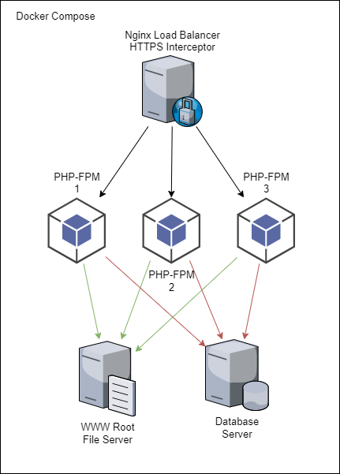
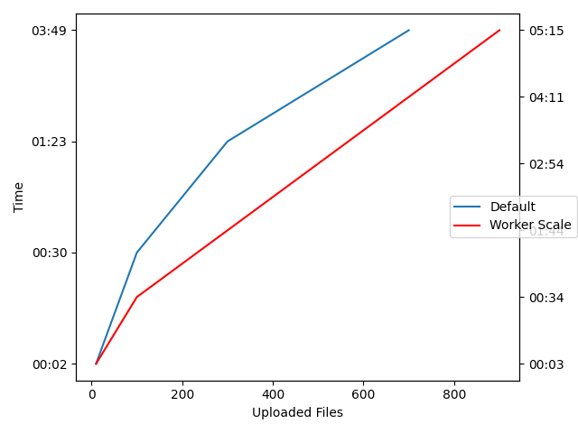

# Nextcloud Done Right
Scaling Options for Netxtcloud.

The default **Baseline** for all tests is a Dockerized Nextcloud Deployment with an Nginx Reverse Proxy, MariaDB Database, Redis Cache and a Nextcloud FPM Worker an a dedicated CronJob Container. The PHP Memorylimit is set to `2048M`.

## Branches
+ master | Nextcloud on TIDB Database (WIP)
+ default | Normal Nextcloud Deployment on MariaDB
+ worker-scale | Nextcloud on MariaDB with 3 PHP Worker load balanced by nginx

## Architecture

## Performance
Comparison between the Default setup with one PHP worker an the setup with three PHP workers.

